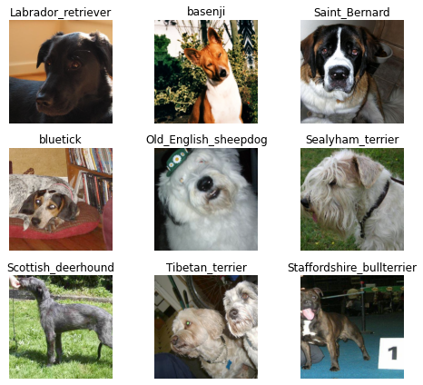

# Image-Classification-using-Resnet34
The DogSpeciesClassification_Resnet notebook trains a neural network classifier based on Resnet34 that is able to differentiate between 120 different species of dogs with over 85% accuracy. The network is trained using the fast.ai library which is built on top of pytorch. The Stanford Dogs Dataset is utilized for training.

## Data Samples

## Directory Structure
The code relies on the data directory to be structured a certain way. The official dataset has a different structure. Use the Directory_structure_change notebook to achieve the required directory structure. 

## Dataset
Download link: https://www.kaggle.com/jessicali9530/stanford-dogs-dataset
